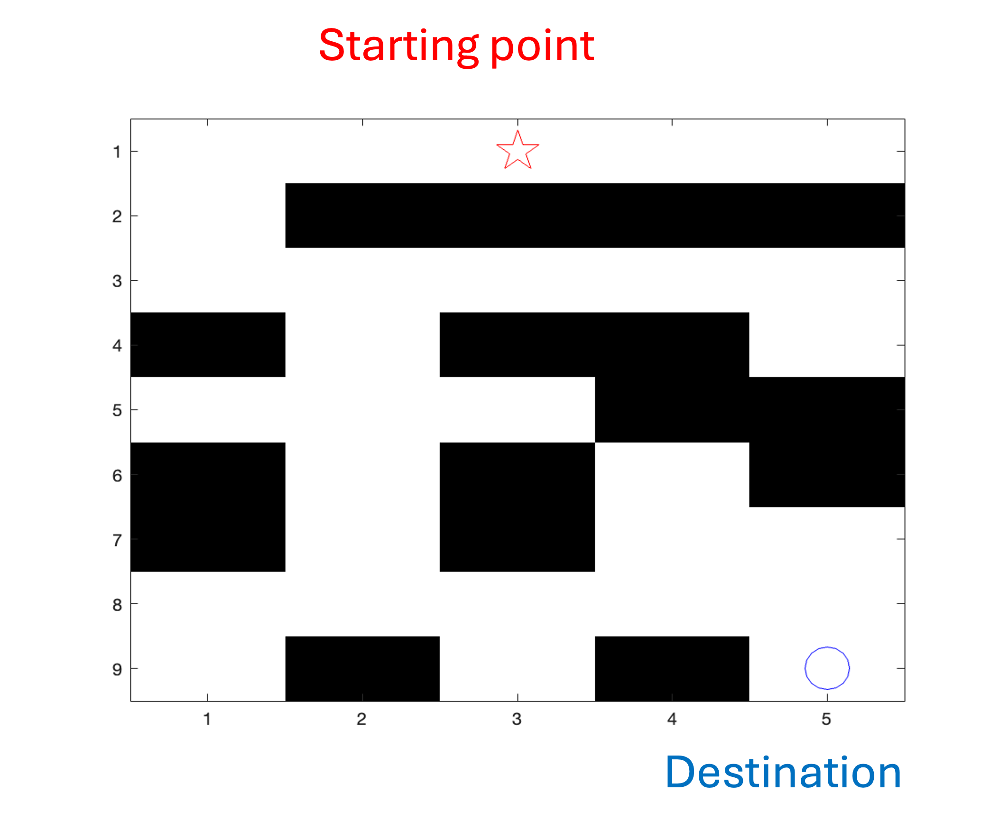
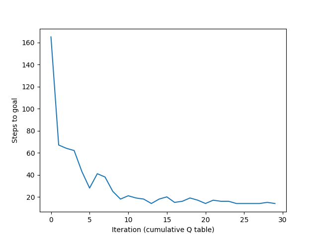

# Reinforcement Learning — A Maze Solver using Q-learning

## Introduction

I implement q-learning (a type of reinforcement learning) with a simple maze game, where the agent is trying to optimize the best route from the starting point to the ending point as shown in the figure above.

I use Python to run my optimization project and visualize it.

## Result

As shown in the figure above, after 30 iterations of the agent going from the starting point to the ending point, we can see that the more iterations the less the steps the agent takes to find the best route.  
This is because I apply **q-learning** where the agent gradually learns more after each iteration.
